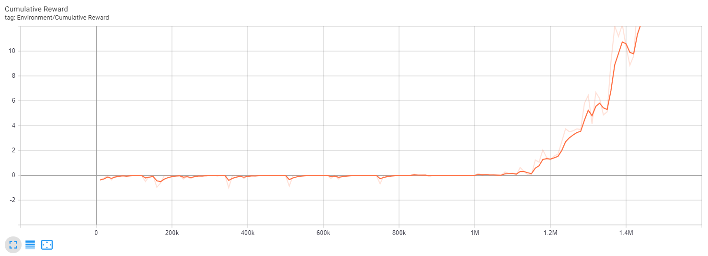

The fifth week of research involved finishing up the ML-Agents Hummingbirds training. 

## ML-Agents Hummingbird Training Results

### The Training

The ML-Agent has made significant progress by the end of its training session which took a total of about 6 hours to complete. However, I was training using CPU only, so the required time could be significantly shorter. But before I show you the end results, I feel it fitting to remind you of how the Hummingbird was performing early on in its training.

First hour and a half of training:

After about two hours of training:

A quick graph of the first two hours of training:

{: .message }

## Next Week's Plan

Next week, I plan on returning with the results of many more hours of training and the completed environment where the player can compete against the ML-Agent. I also plan on going back and fixing up the ML-Agent Penguins just so I can experiment with it a bit more. Finally, I plan on diving into the UnityVGDL Framework.

Thanks for reading! Make sure to check back next week!
